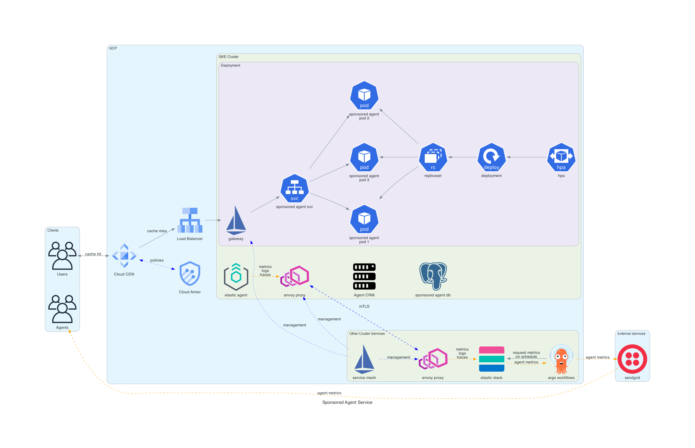

# Sponsored Agent System Architecture

## Overview
A streamlined Kubernetes-based system designed to handle sponsored agent information on community pages. The architecture prioritizes simplicity while maintaining reliability and performance.

## Core Components

### Deployment
- Highly Availiable at minimum
- Auto Scaling
- Auto Healing
- Stateless so no need for stateful set and additional storage cost

### Networking
- Utilizing Istio service mesh
- Sidecars in each pod enable mTLS communication with any services they may need to communicate

### Storage
- Metrics gathered by elastic agent and pushed to elasticsearch
- Agent Data is gathered from the CRM (could implement caching here if needed as well)
- Postgres can be in cluster or a managed service.

### Caching/CDN
- Cloud CDN for caching agent service responses and assets
- Faster load times and reduced latency (possible SEO impact)
- Significantly reduces load on service for repeat requests

### Security
- Cloud Armor policies to restrict access
- Alerting based on collected metrics for suspicous activity
- mTLS everywhere (utilizing cert-manager)

### Data Storage
- Agent CRM for source of data (can implement caching layer here using redis if needed)
- Metrics gathered by elastic agent and sent to elastic stack

### Workflows
- Workflow runs on a schedule (or can be triggered via API)
- Gather data from elastic and use third party email service for sending metrics to users
- Can be replaced with any workflow tool (n8n, windmill, trigger.dev, etc.) but integrates nicely with other CNCF tooling.

## Key Design Decisions

### Simplicity First
- Majority of services run within Kubernetes for unified management
- Minimal external dependencies
- Using managed services where it makes sense (CDN, Email)
- Seperation of concerns (scheduled tasks not dependant on application)

### High Availability and Performance
- Multiple replicas for the service
- Kubernetes native health checks and auto-healing
- Caching at the edge for performance and responsiveness

## Relevant Documentation/Sources
- [GKE Gateway Docs](https://cloud.google.com/kubernetes-engine/docs/concepts/gateway-api#ingress)
- [GKE Cloud CDN => GKE Backend Config](https://cloud.google.com/kubernetes-engine/docs/how-to/ingress-configuration#cloud_cdn)
- [GKE Cloud Service Mesh (based on istio)](https://cloud.google.com/architecture/exposing-service-mesh-apps-through-gke-ingress)
- [GKE Cloud Armor Integration](https://cloud.google.com/armor/docs/integrating-cloud-armor#hybrid) | [(gke integration)](https://cloud.google.com/armor/docs/integrating-cloud-armor#with_ingress) | [(cloud cdn integration)](https://cloud.google.com/armor/docs/integrating-cloud-armor#cloud-cdn)
- [GKE Architecture References](https://cloud.google.com/architecture)
- [Istio Cert Manager Integration](https://istio.io/latest/docs/ops/integrations/certmanager/)
- [Istio Architecture References](https://istio.io/latest/docs/ops/deployment/deployment-models/#multiple-clusters)
- [Elastic GCP Metrics Collection](https://www.elastic.co/guide/en/observability/current/monitor-gcp.html)
- [Argo Workflows](https://argo-workflows.readthedocs.io/en/latest/use-cases/data-processing/)